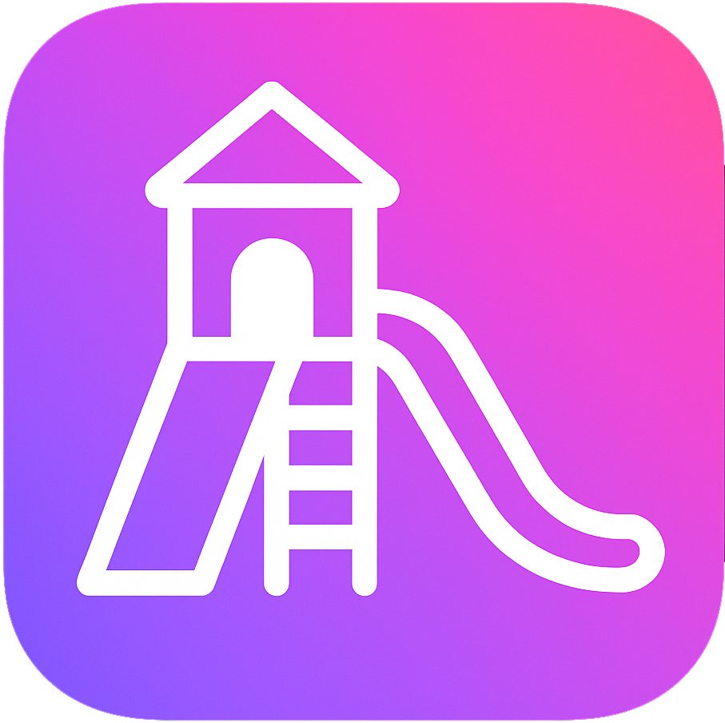

# Mihai's AI Playground 🎉🤖

**Welcome to the most playful, glassy, and AI-powered playground on the web!  
Built for the [Hack Club](https://hackclub.com/) Neighborhood Hackatron, Mihai's AI Playground is your one-stop shop for fun, creativity, and clever AI tools—all wrapped in a pink-purple glassmorphic vibe. ✨**

 

### 🌐 **Live at:** [mihais-ai-playground.xyz](https://mihais-ai-playground.xyz/)

### 🐳 **Docker Hub:** [cristianeduardmihai/mihais-ai-playground](https://hub.docker.com/repository/docker/cristianeduardmihai/mihais-ai-playground)

> ⚠️ **Note:** This app uses the Hack Club AI API, which is only for Hack Club projects. Please don't self-host unless you're part of the club!

## 🦄 Features

- **Glassmorphic Design**: Pink, purple, and pure fun! Modern, accessible, and beautiful on every device.
- **Super Scalable** 🚀: Add new tools or languages in minutes—just drop in a component or update a config.

### 🧩 **Modules**

#### Learning 📚
- **Language Buddy 🌍**: Practice your target language with an AI buddy!
- **Spell Check 📝**: Correct your writing, tone and much more.
- **Translator 🌎**: Translate text between multiple languages.
- **Text Summarizer 📚**: Summarize long texts into concise summaries.

#### Health 🥗
- **Recipe Maker 🍳**: Input your ingredients and let AI suggest recipes. Customize how healthy the recipes should be!

#### QOL Tools ✨
- **PC Part Picker 🖥️**: Get AI-generated recommendations for PC parts based on your preferences.
- **Color Palette Picker 🎨**: Generate color palettes for your projects with AI.
- **Interview Prep Assistant 🎤**: Prepare for your next job interview with AI-generated questions and tips.
- **HTML5 Portfolio Builder 🖼️**: Create a beautiful HTML5 portfolio to showcase your work, with AI assistance.

#### Fun 🤖
- **Bot Vs Bot Roast Battle 🔥**: Watch two AI bots engage in a hilarious roast battle!
- **Personality Quiz 🎭**: Answer fun questions and get a playful AI-generated personality analysis!
- **Reddit-like Storyteller 📖**: Generate stories in the style of your favorite subreddits.
- **Character Chat 🤖**: Chat with your favorite cartoon characters!
- **Coder Profile 🧑‍💻**: Upload your code and get a playful coder personality analysis!

